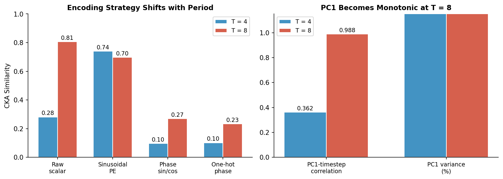

<div align="center">

# 循环 RL 智能体会发现唯一的内部时钟吗？

**反对规范时间编码的证据**

[](paper/temporal_repr.pdf)
[]()
[**English**](README.md)

</div>

---

## 一句话总结

我们在周期性任务上训练 LSTM 智能体，发现**不同的随机种子产生根本不同的时间内部表征**——尽管行为表现完全相同。不存在单一的"规范"时间编码。

## 核心发现

| | Seed 42 | Seed 456 |
|---|---|---|
| **Return** | 0.920 | 0.920 |
| **R²(时间步)** | 1.000 | 1.000 |
| **最匹配的编码** | 正弦 PE (0.74) | 相位 sin/cos (0.62) |

相同的行为，不同的内部时钟。

## 时间范围效应

随着时间范围增加，智能体的表征从正弦编码转向标量编码：

<p align="center">

</p>

## 仓库结构

```
├── paper/              # 论文 (PDF, LaTeX, BibTeX)
├── agents/             # LSTM & MLP actor-critic
├── environments/       # DoorGrid 环境 + 时间 wrappers
├── analysis/           # CKA, 线性探测, PCA, MI
├── experiments/        # 训练 & 评估脚本
├── figures/            # 每种子实验结果 JSON
├── results/models/     # 训练好的模型权重 (.pt)
├── run_all.py          # 一键复现
└── compute_cross_seed_cka.py
```

## 快速开始

```bash
conda activate rlenv
python run_all.py --phase all       # 一键复现
```

分步运行：

```bash
python run_all.py --phase train     # 训练全部智能体
python run_all.py --phase analyze   # 运行分析
python run_all.py --phase figures   # 生成图表
```

## 论文

- **标题**: Do Recurrent RL Agents Discover a Unique Internal Clock? Evidence Against a Canonical Temporal Code
- **PDF**: [`paper/temporal_repr.pdf`](paper/temporal_repr.pdf)

## 引用

```bibtex
@article{temporal_repr_2026,
  title={Do Recurrent RL Agents Discover a Unique Internal Clock? Evidence Against a Canonical Temporal Code},
  author={Anonymous},
  journal={arXiv preprint},
  year={2026}
}
```
